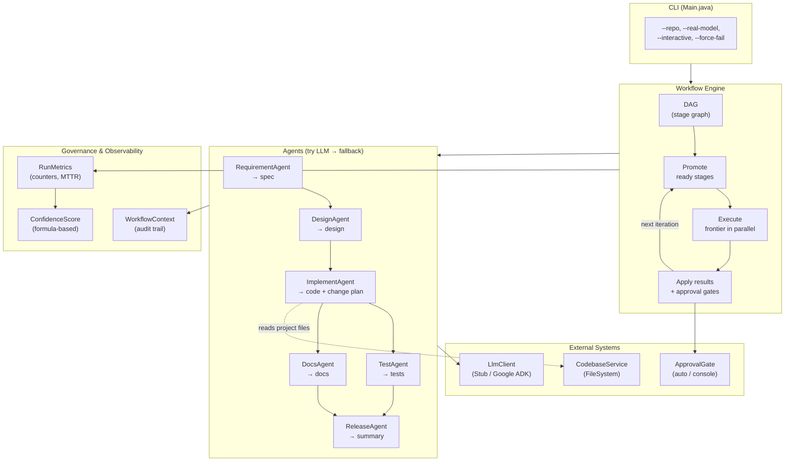

# Agentic SDLC Orchestrator

An orchestration engine that takes a software requirement in plain language and
runs it through a fixed set of lifecycle stages, each handled by an AI agent.
It can operate on an **external codebase** — reading the project's structure and
source files — to produce grounded code changes, tests, documentation, and a
release summary. Every decision is recorded in an audit trail alongside a
confidence score built from observable run outcomes, not model self-assessment.

## Architecture



### Stage pipeline

```
requirement → design → [approval] implement → test  → [approval] release
                                             ↘ docs ↗
```

Test and docs both depend only on implement, so the engine runs them
at the same time. Release waits for both.

### Core patterns

| Pattern | How it works |
|---|---|
| **Try-model-then-fallback** | Every agent tries the LLM first. On any failure (network, timeout, bad parse), it falls back to a deterministic, known-good output. Recorded in the audit trail. |
| **Bounded retries** | Each stage has a retry budget (default 1). Exhausted budget → stage fails, pipeline safe-stops. |
| **Approval gates** | High-impact stages (implement, release) require human sign-off in interactive mode. A rejected stage stops that branch. |
| **Parallel execution** | The engine runs independent stages concurrently on a thread pool and joins before continuing. |
| **Confidence scoring** | Score is computed from observable outcomes: tests passed (+0.40), code compiled (+0.25), static checks clean (+0.15), run finished (+0.20), minus penalties for fallbacks (−0.10 each) and retries (−0.05 each). Clamped to [0, 1]. |

## How to build

### With Maven

```bash
mvn compile
```

### Without Maven

```bash
chmod +x build.sh
./build.sh
```

Requires Java 17+. No runtime dependencies beyond the JDK.

## How to run

### Default mode (stub model, auto-approve)

No flags needed. Uses the offline stub model and approves everything
automatically. Runs anywhere with no API key and no network.

```bash
# Maven
mvn exec:java

# Shell script
./build.sh

# Direct
java -cp build io.github.netha6571.orchestrator.cli.Main
```

### With a custom requirement

Pass the requirement as the last argument:

```bash
./build.sh "Build a URL Shortener service with REST APIs: POST /shorten to create a short URL, GET /{code} to redirect to the original URL, GET /stats/{code} to return click count and creation date. Use an in-memory store. Include input validation and error handling."
```

If no requirement is given, the default is "Add custom alias support".

### With a target codebase

Point the orchestrator at an external project so agents can read its
structure and source files:

```bash
./build.sh --repo /path/to/url-shortener "Add click analytics dashboard endpoint"
```

When `--repo` is provided, the `ImplementAgent` includes the project's
file tree and source code in its LLM prompt, and asks the model to produce
structured file-level changes (`ADD` / `UPDATE` / `REMOVE` per file).

Without `--repo`, the orchestrator works in prompt-only mode — agents
generate output based solely on the requirement text.

### Real model mode

Uses the Google ADK (Gemini) client. Requires the `GOOGLE_API_KEY` environment
variable to be set.

```bash
export GOOGLE_API_KEY=your-key-here
./build.sh --real-model "Build a URL Shortener service"
```

### Interactive mode

Asks for human approval on the console at the implement and release stages.

```bash
./build.sh --interactive "Build a URL Shortener service"
```

### Force-fail mode

Makes the stub model fail on purpose, so every agent uses its fallback. Shows
the fallback path working and produces a lower confidence score.

```bash
./build.sh --force-fail
```

### Combining flags

```bash
./build.sh --repo /path/to/url-shortener --real-model --interactive "Add click analytics dashboard"
```

| Flag | Effect |
|---|---|
| `--repo <path>` | Read the project at `<path>` — agents get file tree and source context |
| `--real-model` | Use Google ADK (Gemini) instead of the offline stub |
| `--interactive` | Ask for human approval at high-impact stages |
| `--force-fail` | Force the stub model to fail (demos the fallback path) |

## What it prints

At the end of a run, the output includes:

1. **Stage states** — the final state of every stage (passed, failed, etc.).
2. **Decision trail** — each entry with its timestamp, stage, source (model or
   fallback), key, value, and reason.
3. **Confidence score** — a number between 0 and 1 built from observable run
   outcomes, with the signals that produced it.
4. **Metrics** — success rate, retries, rollbacks, fallbacks, mean time to
   recover, and total run time.
5. **Outcome** — whether the run finished or stopped safely.

## Package layout

```
io.github.netha6571.orchestrator
├── codebase    — CodebaseService interface + filesystem implementation
├── model       — plain data types (StageId, StageState, ArtifactSource, StageResult, WorkflowContext)
├── llm         — LLM client interface + stub + Google ADK implementation
├── agent       — agent interface, base class, and six lifecycle agents
├── engine      — DAG, Stage, Workflows factory, WorkflowEngine
├── governance  — ApprovalGate, RunMetrics, ConfidenceScore
└── cli         — Main entry point
```

## Class-to-requirement mapping

| Requirement | Class(es) |
|---|---|
| Orchestration engine with stage-based workflow | `WorkflowEngine`, `Dag`, `Stage`, `Workflows` |
| Agent-based processing with LLM | `Agent`, `AbstractAgent`, `LlmClient` |
| Six lifecycle stages | `RequirementAgent`, `DesignAgent`, `ImplementAgent`, `TestAgent`, `DocsAgent`, `ReleaseAgent` |
| Try-model-then-fallback pattern | `AbstractAgent` (the base class holds this once) |
| External codebase access | `CodebaseService`, `FileSystemCodebaseService`, `CodebaseException` |
| Codebase-aware code generation | `ImplementAgent` (reads project tree and source files via `CodebaseService`) |
| Approval gates (controlled autonomy) | `ApprovalGate` (auto-approve and console versions) |
| Bounded retries | `Stage.retryBudget`, retry loop in `WorkflowEngine` |
| Rollback (seam) | Commented hook in `WorkflowEngine.applyResult()` |
| Re-planning (seam) | Commented hook in `WorkflowEngine.run()` |
| Confidence score from run outcomes | `ConfidenceScore` (exact formula from spec) |
| Metrics collection | `RunMetrics` |
| Parallel execution (test + docs) | Thread pool in `WorkflowEngine`, `CopyOnWriteArrayList` in `WorkflowContext` |
| Audit trail | `WorkflowContext` (append-only, timestamped entries) |
| Offline/stub mode | `StubLlmClient` |
| Real LLM integration | `GoogleAdkLlmClient` (Google ADK via built-in HTTP client) |
| Command-line interface | `Main` |

## Scope boundaries

These are stated plainly because naming them is part of the work:

- **The orchestrator reads, it does not write (yet).** The `CodebaseService`
  is read-only. Generated code is output as text — applying changes back to
  the target repo is a future step (apply/patch layer).
- **Rollback and re-planning are seams.** The hooks are there as named,
  commented places in the engine. The full behaviour is left for later.
- **The final sign-off is a gate, not a PR.** Creating a real pull request is
  where the final human sign-off belongs. The gate interface is the seam.
- **No live pipeline.** Running a real build-and-deploy pipeline is stubbed
  behind an interface. Wiring a live pipeline adds fragile outside dependencies
  and shows nothing new about the orchestration.
- **Everything is in memory.** A real build would swap the run context for a
  store that survives a restart.
- **The engine knows nothing about URLs.** It schedules stages and enforces
  gates for any workflow. All domain knowledge lives in the agents, never in the
  engine.
